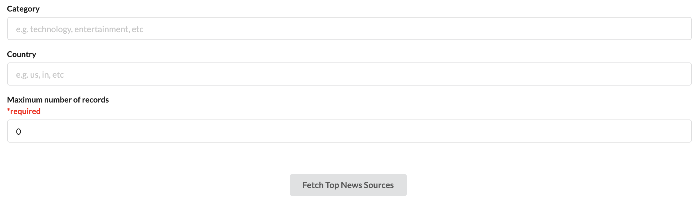
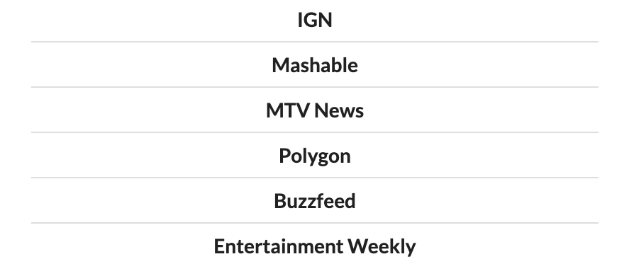

# News

### Supported REST API

[News API](https://www.github.com/saran-shabd/news-api)

## Screenshots





## Steps for Local Deployment

-   First run the supporting `REST API`

-   Run following command to start application
    ```bash
    yarn start
    ```
